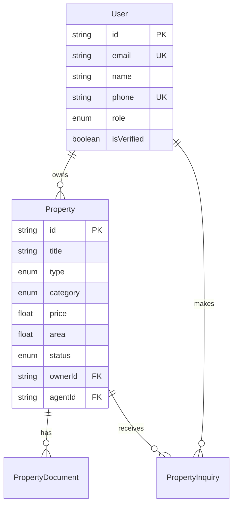

# Dhandha - Land & Property Marketplace Platform

<div align="center">
  
  
  
  
</div>

## 🏡 Overview

Dhandha is a comprehensive marketplace platform designed for land agents, brokers, and consumers operating in Indian tier 1, 2, and 3 cities. The platform addresses key challenges in the unregulated land and plot market by providing verification, protection, and collaboration tools specifically tailored for the Indian real estate market.

## ✨ Key Features

### 🏪 Marketplace Platform
- Multi-tier property listing system (land, plots, gated communities)
- Advanced search and filtering capabilities
- Location-based services for tier 1/2/3 cities
- Image and document management
- Integration with existing Indian property platforms

### 👥 Agent Verification System
- Multi-step agent verification process
- Professional qualification tracking
- Experience and track record validation
- Rating and review system
- Professional certification management

### 🛡️ Consumer Protection
- 3-step listing verification process
- Legal title verification system
- Escrow services integration
- Title insurance services
- Property legal document validation

### 📈 Lead Generation & Marketing
- Automated lead distribution system
- Cross-platform listing syndication
- WhatsApp and SMS integration for Indian market
- Social media marketing tools
- Analytics and performance tracking

### 💰 Financial Services
- Loan calculator and eligibility tools
- EMI calculators
- Integration with Indian banks and NBFCs
- Financial document management
- Investment analysis tools

## 🚀 Quick Start

### Prerequisites

- Node.js 18+ and npm 8+
- PostgreSQL 14+
- Git

### Installation

1. **Clone the repository**
   ```bash
   git clone https://github.com/varunsara/dhandha.git
   cd dhandha
   ```

2. **Install dependencies**
   ```bash
   npm install
   ```

3. **Set up environment variables**
   ```bash
   cp .env.example .env.local
   # Edit .env.local with your configuration
   ```

4. **Set up the database**
   ```bash
   npm run db:generate
   npm run db:push
   ```

5. **Start development servers**
   ```bash
   npm run dev
   ```

   This will start:
   - Next.js frontend on http://localhost:3000
   - NestJS API on http://localhost:3001

## 🏗️ Project Structure

```
dhandha/
├── apps/
│   ├── web/                 # Next.js frontend application
│   ├── api/                 # NestJS backend API
│   └── mobile/              # React Native/PWA mobile app (planned)
├── packages/
│   ├── ui/                  # Shared UI components library
│   ├── database/            # Prisma schema and database client
│   ├── utils/               # Shared utilities and helpers
│   ├── types/               # TypeScript type definitions
│   └── config/              # Shared configuration
├── docs/
│   ├── api/                 # API documentation
│   ├── setup/               # Setup and installation guides
│   ├── architecture/        # System architecture docs
│   └── contributing/        # Development guidelines
├── docker/
│   ├── development/         # Development containers
│   └── production/          # Production containers
├── scripts/
│   ├── setup/               # Setup automation scripts
│   └── deployment/          # Deployment scripts
├── .github/
│   ├── workflows/           # GitHub Actions CI/CD
│   ├── ISSUE_TEMPLATE/      # Issue templates
│   └── PULL_REQUEST_TEMPLATE.md
├── docker-compose.yml       # Development environment
├── turbo.json              # Turborepo configuration
└── package.json            # Root package.json
```

## 🛠️ Tech Stack

### Frontend
- **Framework**: Next.js 14 with TypeScript
- **Styling**: Tailwind CSS + Shadcn/ui
- **Authentication**: NextAuth.js
- **State Management**: React Query + Zustand
- **Maps**: Google Maps API

### Backend
- **Framework**: NestJS with TypeScript
- **Database**: PostgreSQL with Prisma ORM
- **Authentication**: JWT + Passport
- **API Documentation**: Swagger/OpenAPI
- **File Storage**: AWS S3 / Google Cloud Storage

### Development
- **Monorepo**: Turborepo
- **Package Manager**: npm with workspaces
- **Linting**: ESLint + Prettier
- **Testing**: Jest + Cypress
- **CI/CD**: GitHub Actions

### Indian Market Specific
- **Payments**: Razorpay integration
- **SMS**: Twilio for OTP verification
- **Maps**: Google Maps with Indian location data
- **Languages**: Hindi, English, regional languages support

## 📚 Documentation

- [API Documentation](./docs/api/README.md)
- [Setup Guide](./docs/setup/README.md)
- [Architecture Overview](./docs/architecture/README.md)
- [Contributing Guidelines](./docs/contributing/README.md)

## 🚦 Available Scripts

### Root Level Commands
```bash
npm run dev          # Start all applications in development mode
npm run build        # Build all packages and applications
npm run lint         # Lint all packages
npm run test         # Run tests across all packages
npm run type-check   # Type check all TypeScript code
npm run clean        # Clean all build artifacts
```

### Database Commands
```bash
npm run db:generate  # Generate Prisma client
npm run db:push      # Push schema changes to database
npm run db:migrate   # Run database migrations
npm run db:studio    # Open Prisma Studio
npm run db:reset     # Reset database
npm run db:seed      # Seed database with sample data
```

## 🏛️ Architecture

### Monorepo Structure
The project uses Turborepo for efficient monorepo management, enabling:
- Shared code across applications
- Incremental builds and caching
- Parallel execution of tasks
- Simplified dependency management

### Database Design


## 🌍 Indian Market Features

### Multi-Language Support
- Hindi (हिंदी)
- English
- Regional languages (planned)

### Local Integrations
- Indian payment gateways (Razorpay, UPI)
- SMS OTP verification for Indian mobile numbers
- Integration with Indian address/PIN code systems
- Support for Indian measurement units (bigha, guntha, etc.)
- Compliance with Indian data protection laws

### City Tier Classification
- **Tier 1**: Mumbai, Delhi, Bangalore, Chennai, etc.
- **Tier 2**: Pune, Jaipur, Lucknow, Nagpur, etc.
- **Tier 3**: Smaller cities and towns

## 🚀 Deployment

### Development Environment
```bash
# Using Docker
docker-compose up -d

# Using npm scripts
npm run dev
```

### Production Deployment
```bash
# Build for production
npm run build

# Deploy to Vercel (recommended)
npm run deploy:vercel

# Deploy to AWS
npm run deploy:aws
```

## 🤝 Contributing

We welcome contributions from the community! Please read our [Contributing Guidelines](./docs/contributing/README.md) before submitting any pull requests.

### Development Workflow
1. Fork the repository
2. Create a feature branch
3. Make your changes
4. Write/update tests
5. Ensure all tests pass
6. Submit a pull request

## 📄 License

This project is licensed under the MIT License - see the [LICENSE](LICENSE) file for details.

## 👥 Authors

- **Varun Goud Sara** - *Initial work* - [@varunsara](https://github.com/varunsara)

## 🙏 Acknowledgments

- Built with modern web technologies
- Designed for the Indian real estate market
- Focused on transparency and consumer protection
- Community-driven development

## 📞 Support

For support and questions:
- Create an issue on GitHub
- Join our community discussions
- Check our documentation

---

<div align="center">
  <p>Made with ❤️ for the Indian real estate market</p>
</div>