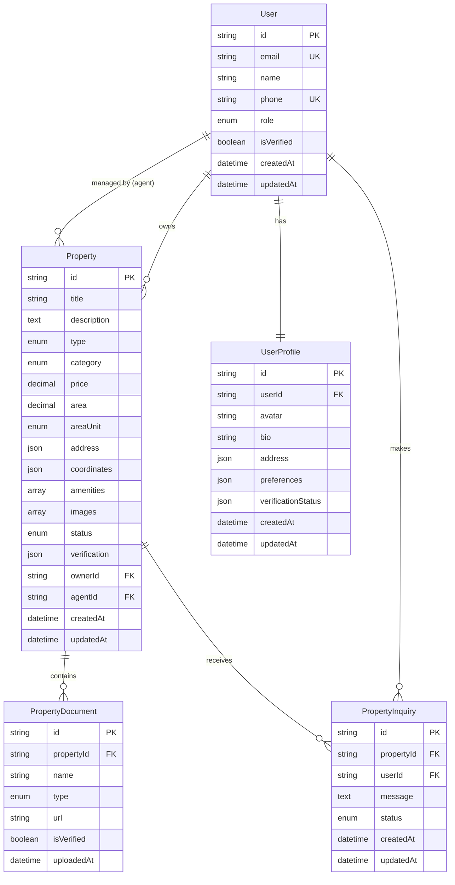

# Architecture Overview

## System Architecture

The Dhandha platform follows a modern microservices-inspired monorepo architecture designed for scalability, maintainability, and developer experience.

### High-Level Architecture

```
┌─────────────────────────────────────────────────────────────────┐
│                        Client Layer                             │
├─────────────────────────────────────────────────────────────────┤
│  Web App (Next.js)  │  Mobile App (PWA/RN)  │  Admin Dashboard │
└─────────────────────────────────────────────────────────────────┘
                                │
                                ▼
┌─────────────────────────────────────────────────────────────────┐
│                     API Gateway Layer                           │
├─────────────────────────────────────────────────────────────────┤
│              NestJS API Server (Node.js)                       │
│  ┌─────────────┬─────────────┬─────────────┬─────────────┐     │
│  │    Auth     │ Properties  │    Users    │   Search    │     │
│  │   Module    │   Module    │   Module    │   Module    │     │
│  └─────────────┴─────────────┴─────────────┴─────────────┘     │
└─────────────────────────────────────────────────────────────────┘
                                │
                                ▼
┌─────────────────────────────────────────────────────────────────┐
│                    Service Layer                                │
├─────────────────────────────────────────────────────────────────┤
│  ┌─────────────┬─────────────┬─────────────┬─────────────┐     │
│  │  Database   │   Storage   │   Payment   │    SMS/     │     │
│  │ (Prisma +   │   (AWS S3/  │ (Razorpay)  │   Email     │     │
│  │PostgreSQL)  │   Local)    │             │  Services   │     │
│  └─────────────┴─────────────┴─────────────┴─────────────┘     │
└─────────────────────────────────────────────────────────────────┘
```

## Technology Stack

### Frontend (Web Application)
- **Framework**: Next.js 14 (React 18)
- **Language**: TypeScript
- **Styling**: Tailwind CSS + Shadcn/ui
- **State Management**: React Query + Zustand
- **Authentication**: NextAuth.js
- **Maps**: Google Maps JavaScript API
- **Deployment**: Vercel

### Backend (API Server)
- **Framework**: NestJS (Node.js)
- **Language**: TypeScript
- **Database ORM**: Prisma
- **Authentication**: JWT + Passport
- **Validation**: class-validator + class-transformer
- **Documentation**: Swagger/OpenAPI
- **Deployment**: Docker + Cloud providers

### Database
- **Primary Database**: PostgreSQL 14+
- **ORM**: Prisma (with type-safe client generation)
- **Caching**: Redis (for sessions and caching)
- **Search**: PostgreSQL full-text search (with future Elasticsearch integration)

### Shared Libraries
- **Monorepo**: Turborepo
- **Package Manager**: npm workspaces
- **UI Components**: Shared component library
- **Types**: Shared TypeScript definitions
- **Utils**: Common utilities and helpers
- **Config**: Centralized configuration management

## Database Schema Design

### Core Entities



## Authentication & Authorization

### Authentication Flow
1. **User Registration**: Email/Phone + Password or OAuth
2. **Phone Verification**: OTP-based verification for Indian numbers
3. **Email Verification**: Email confirmation link
4. **JWT Token Generation**: Access + Refresh token strategy
5. **Role-based Access**: CONSUMER, AGENT, ADMIN roles

### Authorization Matrix

| Resource | CONSUMER | AGENT | ADMIN |
|----------|----------|-------|-------|
| View Properties | ✅ | ✅ | ✅ |
| Create Property | ❌ | ✅ | ✅ |
| Edit Own Property | ✅ | ✅ | ✅ |
| Edit Any Property | ❌ | ❌ | ✅ |
| Verify Properties | ❌ | ❌ | ✅ |
| Manage Users | ❌ | ❌ | ✅ |
| Submit Inquiries | ✅ | ✅ | ✅ |
| View All Inquiries | ❌ | ✅* | ✅ |

*Agents can only view inquiries for their properties

## API Design Principles

### RESTful Design
- **Resource-based URLs**: `/api/properties`, `/api/users`
- **HTTP Methods**: GET, POST, PUT, DELETE
- **Status Codes**: Proper HTTP status codes
- **Pagination**: Cursor-based for large datasets
- **Filtering**: Query parameters for search and filters

### Response Format
```json
{
  "success": true,
  "data": {
    // Response data
  },
  "pagination": {
    "page": 1,
    "limit": 20,
    "total": 150,
    "hasNext": true
  },
  "message": "Success message"
}
```

### Error Handling
```json
{
  "success": false,
  "message": "Validation failed",
  "errors": [
    {
      "field": "email",
      "message": "Email is required"
    }
  ]
}
```

## Security Architecture

### Data Protection
- **Encryption**: All sensitive data encrypted at rest
- **HTTPS**: TLS 1.3 for all communications
- **Input Validation**: Server-side validation for all inputs
- **SQL Injection Prevention**: Prisma ORM with parameterized queries
- **XSS Prevention**: Content Security Policy headers

### Authentication Security
- **Password Hashing**: bcrypt with salt rounds
- **JWT Security**: Short-lived access tokens (15 min)
- **Refresh Tokens**: Long-lived with rotation
- **Rate Limiting**: Prevent brute force attacks
- **Session Management**: Secure session handling

### File Upload Security
- **File Type Validation**: Whitelist approach
- **File Size Limits**: Per file and total limits
- **Virus Scanning**: Integration with antivirus services
- **Secure Storage**: Signed URLs for private files

## Scalability Considerations

### Horizontal Scaling
- **Stateless API**: No server-side sessions
- **Database Pooling**: Connection pooling for PostgreSQL
- **Caching Strategy**: Redis for frequently accessed data
- **CDN Integration**: Static asset delivery via CDN

### Performance Optimization
- **Database Indexing**: Optimized indexes for queries
- **Query Optimization**: Prisma query optimization
- **Image Optimization**: Next.js image optimization
- **Code Splitting**: Dynamic imports for large components
- **Lazy Loading**: Progressive data loading

### Monitoring & Observability
- **Logging**: Structured logging with Winston
- **Metrics**: Application and infrastructure metrics
- **Error Tracking**: Integration with error tracking services
- **Health Checks**: API health endpoints
- **Performance Monitoring**: APM integration

## Deployment Architecture

### Development Environment
```
Developer Machine
├── Docker Compose
│   ├── PostgreSQL
│   ├── Redis
│   └── MailHog
├── Node.js Applications
│   ├── Next.js (Port 3000)
│   └── NestJS (Port 3001)
```

### Production Environment
```
Cloud Infrastructure
├── Load Balancer
├── Application Servers (Docker containers)
│   ├── Next.js Frontend
│   └── NestJS API
├── Database Layer
│   ├── PostgreSQL (Primary)
│   ├── PostgreSQL (Read Replica)
│   └── Redis Cluster
├── Storage Layer
│   ├── Object Storage (S3/GCS)
│   └── CDN
└── External Services
    ├── SMS Provider (Twilio)
    ├── Email Service
    ├── Payment Gateway (Razorpay)
    └── Maps API (Google)
```

## Indian Market Specific Features

### Localization
- **Multi-language**: Hindi, English, regional languages
- **Currency**: Indian Rupee (₹) formatting
- **Address Format**: Indian address standards
- **Phone Numbers**: +91 country code support

### Legal Compliance
- **Data Protection**: PDPA compliance
- **Property Laws**: Indian property law compliance
- **Tax Compliance**: GST and property tax handling
- **Documentation**: Indian property document types

### Market Features
- **Area Units**: Support for bigha, guntha, acre
- **City Tiers**: Tier 1, 2, 3 city classification
- **Payment Methods**: UPI, bank transfers, Razorpay
- **Regional Preferences**: State-specific requirements

## Future Architecture Considerations

### Microservices Migration
- **Service Boundaries**: Extract domains into separate services
- **Event-Driven Architecture**: Message queues for async processing
- **API Gateway**: Centralized routing and authentication
- **Service Mesh**: Inter-service communication

### Advanced Features
- **Machine Learning**: Property price prediction
- **Real-time Features**: WebSocket for live updates
- **Mobile Apps**: React Native applications
- **Blockchain**: Property title verification
- **AI/ML**: Automated property valuation

## Development Guidelines

### Code Organization
- **Domain-Driven Design**: Organize by business domains
- **Clean Architecture**: Separation of concerns
- **SOLID Principles**: Object-oriented design principles
- **Test-Driven Development**: Write tests first approach

### Quality Assurance
- **Type Safety**: Full TypeScript coverage
- **Linting**: ESLint + Prettier for code quality
- **Testing**: Unit, integration, and e2e tests
- **Code Reviews**: Mandatory peer reviews
- **CI/CD**: Automated testing and deployment